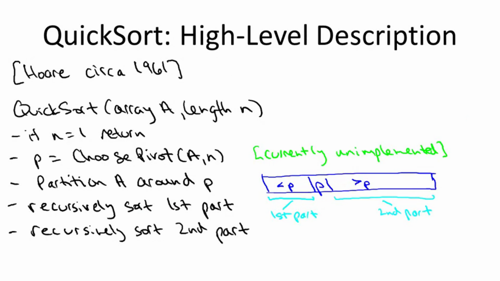
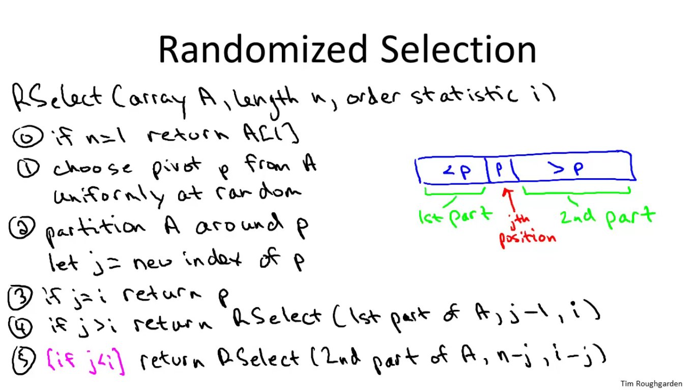
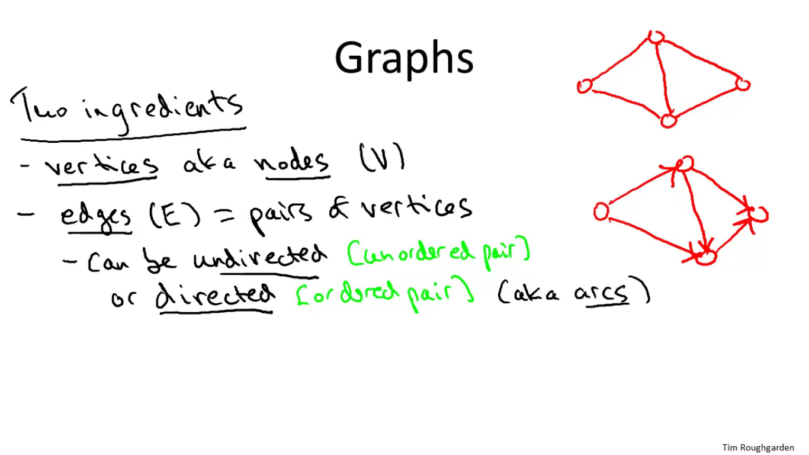
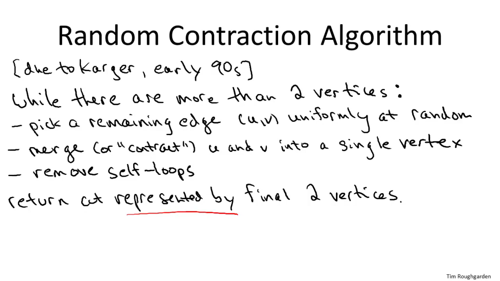

## to do:
- implement randomized selection
- check quick sort
- understand part about randomized search(quick sort)

## Week 2

> Master method

  
 _Formal statements_ 

  
 _Recursive calls_ 

 How to understand _a_ and _b^d_ 

 Case 3 

  
  

## Week 3
#### Quick Sort

## Week 4
#### Randomized selection

#### Graphs

#### Random Contraction algorithm

